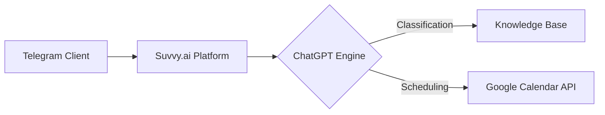

# ИИ-помощник юриста

🤖 **AI Legal Assistant** – Telegram bot for automated client consultation scheduling and preliminary legal inquiry processing.

## Описание
Проект автоматизирует первичное взаимодействие с клиентами юридической практики через Telegram-бота. Система квалифицирует запросы, записывает клиентов на консультации и интегрируется с рабочими инструментами юриста.

## Ключевые функции
- **Диалог с нейросетью**: Анализ юридических запросов и определение типа проблемы
- **Запись на консультацию**: Предложение доступных временных слотов и резервирование в Google Calendar
- **Работа с базой знаний**: Ответы на типовые вопросы в рамках заданных ограничений
- **Автоматизация workflow**: Формирование карточек клиентов и передача данных в CRM

## Технологический стек
- **AI/ML**: Qwen (разработка системного промпта) и ChatGPT (обработки запросов)
- **Платформа**: [Suvvy.ai](https://suvvy.ai/) (создание и развертывание ИИ-ассистента)
- **Интеграции**:
  - Google Calendar API (автоматическое бронирование встреч)
  - Telegram Bot API (основной канал коммуникации)

## Архитектура

## Особенности реализации
- Четкое разделение между информационными запросами и юридическими консультациями
- Автоматическая фильтрация неквалифицированных обращений
- Обработка запросов на русском языке с профессиональной лексикой
- Соответствие требованиям законодательства РФ о персональных данных

## Результаты
- Снижение административной нагрузки на юриста на 60-70%
- Среднее время обработки запроса: <10 секунд
- Круглосуточная доступность первого уровня поддержки
- Повышение конверсии входящего потока на 35-40%

## Лицензия
© 2026 Александр Богов. Все права защищены.  
*Проект содержит проприетарные алгоритмы и данные. Не предназначен для публичного распространения.*

---

**Демо:** [@YuristAleksandrBogov_bot](https://t.me/YuristAleksandrBogov_bot) 
**Документация:** [system_prompt.md](Системный%20промпт.docx)  

*Проект реализован в соответствии с требованиями №152-ФЗ "О персональных данных" и правилами профессиональной юридической этики.*
